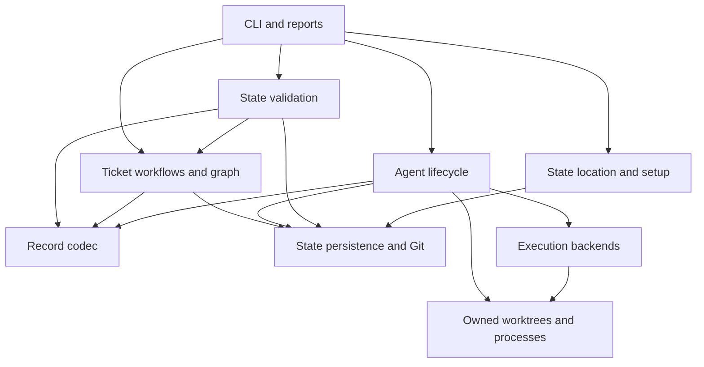
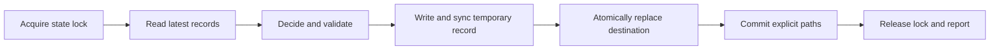
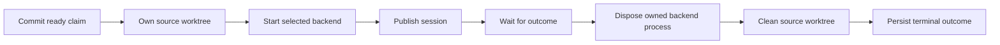

# Architecture and compatibility

This describes the implemented system. `specs/` also contains historical
proposals; where they differ, the contracts below and CLI tests describe the
current behavior. The governing design guidance is Chad's `CODE.md`.

## Functionality inventory

| Area | Contract |
| --- | --- |
| Invocation | `init`, `check`, `repair`, `ticket {new,get,update,list}`, `agent {new,get,update,list,run,stop}`. Clap rejects invalid arguments with exit 2; application errors exit 1. Successful commands exit 0, except unsuccessful backend runs preserve the available process exit code. |
| Global options | `--waap-root` selects the state directory, relative to the invocation directory; `--output-format {human-readable,json}` defaults to human-readable; `--verbose`/`-v` overrides `WAAP_LOG_LEVEL`, whose default is `error`. Logs go to stderr. |
| New records | Markdown comes from stdin. Optional `--name` produces an ASCII lowercase slug; otherwise IDs use eight random hex characters. IDs have `tt-` or `aa-` prefixes and a slug shorter than 64 bytes. Collisions and long names receive four random hex characters. Empty slugification historically falls back to `ticket` for both record kinds. |
| Record schema | TOML frontmatter between exact `+++` delimiter lines, followed by markdown. Both kinds require a TOML `creation_date` and a known `status`; `name` is optional. Unknown keys are rejected. Tickets accept deprecated `title` as a fallback for `name`, and rewrite it as `name` on update. Agents accept deprecated `role` but discard it on rewrite. |
| Tickets | Status is `pending`, `in-progress`, `completed`, or `abandoned`. `--set-status` has no lifecycle restrictions. Optional `depends_on` is a list of existing ticket IDs; missing/empty lists normalize to no dependencies. Duplicate persisted edges are accepted. New tickets preserve requested dependency order. |
| Dependency updates | `--add-depends-on` adds absent edges; `--remove-depends-on` removes all matching edges and ignores absent ones. Removal wins when the same edge is added and removed. Missing additions and invalid IDs are rejected. A candidate graph must have no missing targets or cycles before it is published. |
| Eligibility | A ticket is blocked when any direct dependency is not completed. Abandoned dependencies still block. Tickets with no dependencies are unblocked regardless of their own status. Listing combines `--status` with either `--blocked` or `--unblocked`; the two latter options conflict. |
| Agent lifecycle | `ready -> running/aborted`; `running -> completed/failed/aborted`; terminal states cannot be restarted. Update cannot directly abort a running agent; use stop. Session assignment requires running status, no existing session, and no simultaneous status change. Runner terminal persistence is idempotent for the same terminal status and rejects conflicting terminal statuses. |
| Running | `--agent-id` is required; `--system {opencode,claude,codex}` defaults to OpenCode. `--model` and `--reasoning-effort` are Codex-only. A ready claim and system are committed before worktree creation; the authentic started session is committed before waiting. Completed outcomes mark completed; failed outcomes and infrastructure errors attempt to mark failed without overwriting concurrent terminal changes. |
| Backend configuration | OpenCode requires `OPENCODE_SERVER_URL`, `OPENCODE_SERVER_USERNAME`, `OPENCODE_SERVER_PASSWORD`, and `OPENCODE_SERVER_MODEL`. Claude reads optional `CLAUDE_MODEL`. Codex CLI options override `CODEX_MODEL`/`CODEX_REASONING_EFFORT`; omitted values preserve backend defaults. Accepted Codex efforts are `none,minimal,low,medium,high,xhigh,max,ultra`; invalid environment effort is rejected before claiming the agent. Stop does not require Codex run configuration. |
| Backend execution | OpenCode creates a remote session, subscribes to repository-wide SSE before submitting the async prompt, forwards matching events, and completes on matching idle. Its directory remains the invocation repository root, not the managed worktree. Claude runs `claude -p` attached to stdout/stderr with null stdin, a generated UUID, and optional model. Codex owns a stdio app-server, initializes it, starts a thread, and drives a turn through JSON-RPC. |
| Stop | Explicit stop permits ready or running agents; stop-all selects running agents in ID order. Sessionless agents skip backend configuration/abort. Legacy records without `system` default to OpenCode. OpenCode calls remote abort, Claude signals matching session processes, and Codex signals the waap runner to request turn interruption. A failed abort leaves that agent unchanged. Stop-all commits the selected records together after successful processing. |
| Outputs | Mutation reports include their Git commit. Get reports include metadata, path, byte size, and markdown. Agent get preserves the body exactly; ticket get removes one initial newline. List reports are JSON arrays of IDs/statuses (tickets also expose `blocked`) or aligned tables, sorted by stored creation-date text with ID order breaking ties. Existing JSON field names and omission rules remain unchanged; persisted agent `system` is not included in the public report metadata. Run stdout can contain multiple reports plus backend output. |
| State resolution | The invocation checkout is found by walking to `.git`. The common Git directory must be `<primary repository>/.git`. Default state is `$HOME/.local/state/waap/data/<absolute-primary-path-without-root>`, shared across linked worktrees. HOME must be absolute. Explicit state overrides do not require default HOME derivation. Commands still require invocation from a repository. |
| Initialization | Creates or adopts a local `waap` branch/worktree. Adopts already-fetched `origin/waap` if no local branch exists; otherwise creates orphan state with agents/tickets markers and one init commit. Configures upstream when `origin` exists, without fetching or pushing. An occupied target is rejected. Application HEAD stays unchanged. |
| Migration/repair | `scripts/migrate-legacy-waap.py` explicitly moves legacy `.waap` from the primary checkout, preserves matching/destination-only files, rejects conflicts/symlinks, commits copied paths, validates, then removes and commits legacy deletion. `repair` relocates a registered state checkout after moving the primary repository, repairs Git links, preserves dirty files/history, and restores the move if link repair fails. It rejects `--waap-root`, ambiguous registration, and occupied destinations. |
| Validation | Checks record directories, schemas, dependency existence, and cycles; agent/ticket commands validate before dispatch. Schema-only validation can inspect a non-Git state directory. Validation does not fetch, check dirty-state cleanliness, validate state-only Git history, or reconcile legacy coexistence. Those are historical proposal requirements, not current implemented contracts. |
| Persistence | Only explicit record paths are staged/committed; unrelated staged edits survive; unchanged paths return current HEAD without a new commit. Git failure is reported rather than hidden. Ordinary new/update/stop commands retain written records on commit failure, for manual recovery. State changes are local, with no automatic push. |
| Worktrees | Source checkout is `worktrees/<agent-id>` on a fresh branch named for the agent, cut from invocation HEAD. State resides separately. Worktrees are forcibly removed on success, failure, and ordinary stack unwinding; committed branches remain for integration/review. Waap does not merge source automatically. Existing branches/occupied paths cause creation failure rather than reuse or deletion. |

Representative flows:

* `ticket update`: CLI validation -> state lock -> load records -> apply requested
  changes -> validate candidate graph -> atomic record publication -> scoped Git
  commit -> report. A rejected graph changes neither record nor HEAD.
* `agent run`: validate configuration/ready precondition -> locked ready claim ->
  source worktree -> backend start -> locked session publication -> backend wait ->
  process disposal -> worktree cleanup -> locked terminal transition -> report.
  Competing claimants cannot mark the active owner's record failed.
* `agent stop`: locked selection -> backend abort where needed -> reread and
  validate transition -> atomic aborted record -> scoped combined commit.

## Directional design

Starting from the requirements, the simplest useful design has functional ticket
and agent workflows, a pure record codec, one state persistence boundary, an
interchangeable execution interface, and resource owners. This fits the existing
small synchronous CLI; an async service, generic repository framework, or global
backend registry would add responsibilities without a current need.

These are nine cohesive responsibilities, not a requirement to put each in one
file. Modules remain grouped by current functionality:

| Component | Implementation/interface | Invariants and failures |
| --- | --- | --- |
| CLI/reports | `cli.rs`, `app.rs`, workflow-local formatters | Parse once; route to one workflow; preserve human/JSON formats and exit codes. |
| Location/setup | `root.rs`, `init.rs`, `repair.rs`, migration script | Distinguish source from state; never guess occupied destinations; preserve source HEAD. |
| Validation | `check.rs` | Accumulate actionable path/schema diagnostics in stable directory order; lock Git-backed state during traversal. |
| Ticket workflows/graph | `ticket/`, metadata/formatting in `ticket.rs` | Graph validation operates on immutable candidate metadata; stable roots; iterative DFS supports deep chains. Filesystem and Git effects stay outside the graph algorithm. |
| Agent lifecycle | `agent/run.rs`, `stop.rs`, `update.rs`, transition policy in `agent.rs` | Reread under lock before transition; preserve terminal conflicts and original error context. State lock never spans a backend run. |
| Record codec | `frontmatter.rs`, `record.rs`, `toml.rs`, kind-specific schema parsers | File and in-memory frontmatter share a parser; a full record's metadata and body come from the same read. Header-only loaders stop at the closing delimiter even for a non-UTF-8 body. Single-line TOML string escaping prevents embedded delimiter collisions. |
| Persistence/Git | `state.rs`, `git.rs` | OS lock lives outside tracked state, in the selected checkout's Git directory. Atomic same-directory replacement publishes complete records. Explicit paths preserve unrelated changes. |
| Execution backends | `agent/backend.rs`, system modules | Existing object-safe backend/run-handle contracts remain replaceable by fakes; protocol and configuration details stay system-local. |
| Resource owners | `agent/process.rs`, `worktree.rs` | Local children remain owned until reaped; abandoned startup/handles kill and reap them. Worktree guard has explicit cleanup and Drop fallback; cleanup errors retain the primary failure. |

State persistence zoom:

Execution zoom:

Failures after worktree creation take the same disposal/cleanup path. A backend
handle dropped before wait still owns its local child. Codex's signal registration
is also scoped to its run and unregistered on disposal.

## Alternatives and incremental path

* Keep the existing backend trait: implementations are the extension axis here,
  and fake implementations already serve tests. A second resolver abstraction
  or protocol hierarchy is unnecessary for one selected synchronous backend.
* Use borrowed graph data and functions: adding graph operations is the likely
  extension axis. A graph trait, persistent graph cache, or new DAG dependency
  would add indirection and invalidation obligations.
* Prefer an OS advisory lock over create/delete lockfiles: it releases when the
  process exits and avoids stale-lock guessing. The lock inode is deliberately
  retained after release; deleting it can admit two simultaneous owners.
* Promote the already-used open-source `tempfile` dependency to runtime instead
  of implementing temporary filename allocation, collision handling, and cleanup.
  Its guarded same-directory publication is narrowly used. No new package was
  added. Rust 1.89 is the declared minimum for standard-library file locking.
* Preserve the existing file-write/commit recovery contract rather than building
  an event store or pretending filesystem replacement and Git commit form one
  crash-atomic transaction. Existing terminal-transition rollback remains local
  and its failures retain both diagnostics.

The incremental changes characterize compatibility first, then extract pure
graph validation and worktree ownership, introduce shared locking and atomic
publication, and retain/reap local backend processes. No public trait, new CLI
feature, record field, or automatic integration policy is introduced.

## Intentional corrections

1. Cyclic ticket updates, including self-dependencies, fail before writing.
2. Parallel mutations serialize ID allocation, dependency decisions, lifecycle
   transitions, and Git commits. Validation/get/list readers use the same lock,
   preventing transient missing-record errors during directory creation.
3. Record metadata and markdown are decoded from one published version.
4. A competing agent run is rejected without failing the existing owner.
5. Claude/Codex local children are terminated and reaped when startup, session
   publication, protocol processing, or waiting fails. Codex retains its server
   process and unregisters its run-scoped SIGTERM handler.
6. Validation diagnostics have stable directory/root order; graph traversal no
   longer consumes the Rust call stack. Strings containing TOML control characters
   serialize validly with single-line escaping, including embedded `+++` lines.

Normal CLI syntax, metadata schema, markdown, ID rules, output shapes, commit
subjects, backend selection/configuration, source branch retention, and unrelated
staged edits remain compatible. Atomic replacement preserves existing file mode;
new Unix records keep the usual `0666 & !umask` mode.

## CODE.md checklist

| Guideline | Decision, verification, or explicit exception |
| --- | --- |
| 5–10 components; self-similar diagrams; no spaghetti | Nine functional responsibilities and two zoom diagrams above; effects follow explicit directional handoffs. |
| Composable/interchangeable behaviors | Retain `AgentSystemBackend` and owned `RunHandle`; lifecycle tests replace real systems with fakes. |
| Immutable data preferred | Candidate dependency graph is validated before publication; traversal mutation is private algorithm state. Small mutable metadata values remain local to a transition. |
| Remove dead code; repair encountered defects | In-memory parser becomes used and loses dead-code suppression; duplicate parser/recursive validator removed; listed defects get regressions. |
| Group by functionality, not type | Graph under tickets; worktree/process ownership under agent execution; schemas remain with their workflows. No catch-all model/repository layer. |
| Data/object anti-symmetry | Graph operations use metadata/maps; backend implementations use a narrow behavioral trait. |
| Minimize knowledge; hide details | Workflows do not implement tempfile allocation/locking; graph knows no filesystem/Git; lifecycle knows normalized backend outcomes, not HTTP/JSON-RPC internals. |
| Avoid unnecessary abstraction | No global registry, event framework, generic storage trait, or async runtime. Resource guards represent actual owned resources. |
| Smallest variable/function/constant scope; need-to-know exposure | New helpers default private or parent-only; table header constants move into their only functions; traversal state is local. Crate-visible state and graph functions are needed by existing callers. |
| Descriptive, verb-led functions; consistent terms | `acquire`, `write_record_atomically`, `validate_dependencies`, `append_cycle_errors`, `take_stdin`, `wait`; resource names use repository/source terminology, not state-root terminology. Existing `from_*`/`as_*` conversion conventions are retained. |
| Avoid magic numbers | Semantic thresholds remain existing ID/configuration rules; no arbitrary production size thresholds. Protocol method/status constants remain named. Numeric test counts intentionally describe test scenarios. |
| One responsibility; explicit handoffs | Codec, graph decision, state publication, scoped Git commit, normalized backend execution, and cleanup have separate contracts. |
| Preconditions early; focused functions | Reject invalid transition/configuration/IDs/dependencies before launch or write. Candidate cycle rejection is before persistence. |
| Side-effect-only functions | Pure graph/escaping/output-value transformations remain separate from I/O. **Practical exception:** small synchronous workflow functions sequence reads, decisions, writes, and commits; scattering each into a generic orchestration framework would obscure ownership and error order. |
| Readable code; rationale-only comments; no code work logs | Comments explain retained lock inode and resource ownership, not chronological changes. Progress is in waap agent records; architecture is documentation; revisions are in Git. |
| Own dependency stack; maintenance cost; open source | Reuse the TOML parser and existing tempfile package; standard library locking adds no dependency. Existing Clap/HTTP/signal dependencies remain unchanged. No proprietary library is added. |
| Actionable user errors; root-cause context without secrets | Missing dependencies/cycles/paths name the offending record; invalid lifecycle/configuration errors retain accepted values or remediation. Cleanup diagnostics preserve original I/O kind. Spawn failures name the executable without logging argv/configuration credentials. |
| Eliminate vague names/duplication/long functions/interfaces/records/parameter lists/globals/mutation/ripple/speculation/inconsistent objects/missing cleanup | Remove duplicate parsing and validation; extract resource ownership; keep mutable traversal/transition state local; no new global state; retain narrow existing backend contracts. **Practical exception:** existing six-argument runner entrypoints and CLI dispatch remain explicit, avoiding a new context bag or command framework solely to meet a size metric. Metadata string statuses remain for schema/output compatibility, with enum transition validation. |
| All changed behavior tested; pyramid | Pure graph/codec/lock/process unit tests; real local Git/component contract tests; focused CLI tests for concurrency and protocol cleanup; separate real-agent heat workflow. No external network/agent is required by `cargo test`. |
| Named references | CODE.md was read completely. The books/papers it names were not consulted; no claim of reviewing them is made. |

## Failure limits and recovery

The advisory lock coordinates waap processes using the same selected state
checkout/index. Separate clones, manual Git commands, editors, migration, init,
and repair are not covered by that transaction lock. Stop-all can leave earlier
agents aborted but uncommitted if a later abort fails, matching prior behavior.
An ordinary commit failure leaves valid changed files (and possibly staged paths)
for inspection and an explicit Git commit; check validates content, not cleanliness.
A failed initial running claim restores the previous ready record under the
state lock, allowing retry without starting a backend or altering a competing
owner. Rollback failures retain the original error and require manual recovery.
This refactor does not implement whole-index rollback; the index may retain the
attempted claim after its working-tree record is restored.

Atomic publication prevents partial record contents being observed; it is not a
multi-record/database transaction or a guarantee against power loss between
rename and directory synchronization. Existing replacement metadata beyond file
mode (ownership, ACLs, extended attributes, hard links) is not preserved by
tempfile replacement. Direct edits do not participate in the advisory lock.

Drop cleanup runs on normal return and Rust unwinding, including backend errors.
SIGKILL and unhandled termination signals cannot run Drop. Process guards reap
their immediate children, not arbitrary descendant process groups. Codex's
existing blocking protocol read can delay observing SIGTERM until the next
message; existing pkill matching remains unchanged. OpenCode remote sessions
are not owned local child processes and can survive failed startup/publication;
its repository-root directory contract also remains unchanged. No destructive
real-workflow recovery or real Claude/OpenCode service validation is implied.

See [validation.md](validation.md) for exact commands and observed results.
